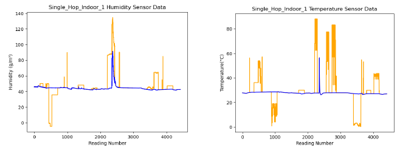

# Fault-Detection-in-Wireless-Sensor-Networks-using-Statistical-Machine-Learning-Methods-and-Neural-Ne
I have used different machine learning algorithm such as Support Vector Machine (SVM), Random forest, K-Nearest Neighbor (KNN), Decision Tree, Gradient Boost, XG Boost and Recurrent Neural Network (RNN) for classification. 

Data used can be accessed from https://www.kaggle.com/raavisoni/dataset

Results:

